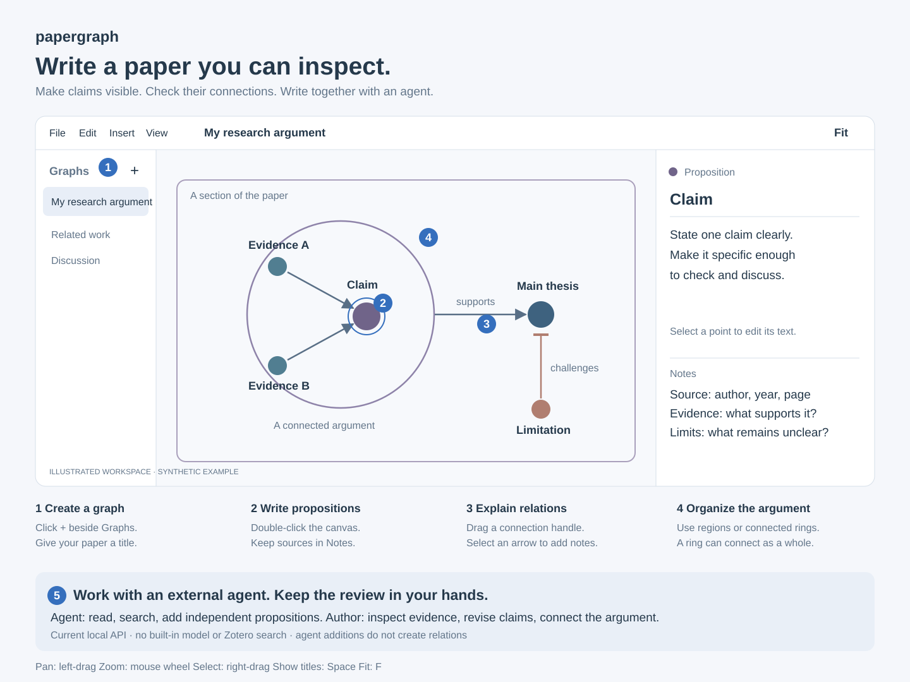

# papergraph

**用图关系写论文，让人与 Agent 围绕可检查的内容共同写作。**

papergraph 是一款本地 Windows 桌面工具。观点、判断和待展开的论述是点，论证关系是边，区域和圆环用来组织论文的不同部分。作者可以逐项检查命题、记录证据、说明连接理由，并在整体结构与局部细节之间切换。

它主要面向 AI 写作后的审阅问题：流畅的文字可能掩盖未经支持的判断、隐含前提和薄弱的论证关系。将这些内容拆成可定位、可讨论、可修改的对象，有助于人与 Agent 一起推进写作。

## 当前功能

- 命题、独立笔记、短标题和自定义颜色。每个对象有固定四页 Notes，第一页保留给作者，Agent 只写入第二至第四页。
- 实时全文：按有向 Body 连线生成正文，圆环换行、方框分段；未连接的正文结构分别显示为不同页面，Reference 引用连线与孤立点不计入正文。可检查阅读顺序、分叉和循环，点击正文即可定位原命题。
- 全文面板实时统计当前页与所选文本的 Words 和 Characters，支持中文、日文与混合语言文本。
- 带方向与语义符号的关系箭头；关系也能保存标题和笔记。
- 可交叠的方框区域，以及内部结构可见、整体可连接箭头的圆环分组。
- 分组内部视角、缩放、多选和深浅主题。Fit all 显示全图；Fit edit 保留适合编辑的最小缩放比例。
- Links 按钮切换全部、框内或跨框连线，仅改变显示；重启后保留选择。单按方向键在同一框内选择节点，快速双按可进入相邻框。
- 方框可直接连接；标题显示在框外，进入框后保留淡色边界，操作柄随缩放变化。双击添加命题时保持当前视野。
- 按最内层方框区分框内与跨框连接，避免外层大框干扰判断。
- 框内有向排版保留圆环大小与分组归属；节点、圆环和连线可用醒目颜色标记。
- 右键复制方框或多选内容，在其他位置或页面粘贴；画布也支持 Ctrl+C / Ctrl+V。
- 左侧多图列表和分类管理、新建与改名、本地自动保存、另存、回收站删除和 Markdown 导出。
- 本地 Agent 接口：读取和搜索当前图，添加独立命题，或批量编辑节点、连线和方框，以及创建连通圆环。写入包含文档与版本检查，保存成功后才返回结果，整批操作支持撤销。
- Agent 可查看页面列表、新建页面、完整复制页面、切换页面，也可在不切换的情况下读取其他图。新建和复制默认在后台进行；重复请求不会重复建页。页面操作前保存当前编辑，原页面保持独立。
- Agent 可通过 `fullText` 直接读取正文页面及顺序检查，通过接口管理分类、设置正文或引用连线、指定分支顺序及编辑允许写入的 Notes 页面，无需操控桌面窗口。

目前没有内置大模型、自动事实核验或 Zotero 检索。更完整的来源追踪和变更审阅是后续方向。

## 使用

从 [Releases](https://github.com/wangyuer1-lang/papergraph/releases/latest) 下载 Windows x64 压缩包，解压到可写文件夹后运行 `papergraph.exe`，当前应用版本为 0.14.3，无需另外安装 .NET。

左侧 Graphs 旁的“＋”用于新建图；双击画布创建命题。点击对象，在右侧填写正文及笔记。右键图名可另存、打开文件位置或移到系统回收站。默认数据保存在程序旁的 `Data` 文件夹；升级时请保留这个文件夹。

详见 [英文用户指南](docs/usage.md)、[Agent 接口](Agent%20guide.md) 和 [构建说明](README.md#build-and-test)。应用界面目前为英文，支持输入中文等 Unicode 文本。

项目采用 [MIT 许可证](LICENSE)。

## 支持 papergraph

如果 papergraph 对你的论文写作或审阅有帮助，欢迎[赞助我](https://github.com/sponsors/wangyuer1-lang)，支持我继续维护项目、改进写作体验和完善使用文档。金额随意，谢谢你的支持！
